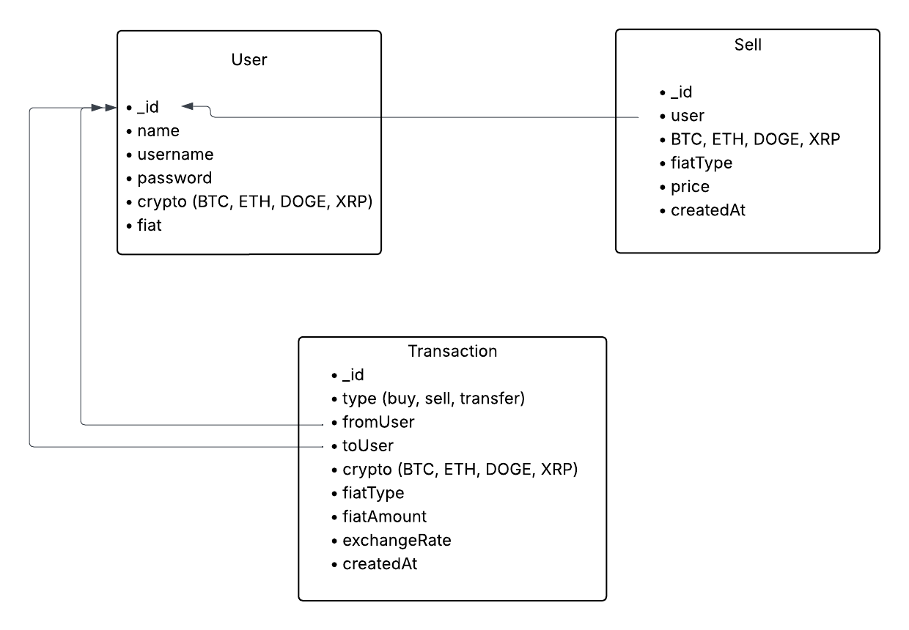

# Crypto

ขั้นตอนการ Run project
- npm i
- ให้แก้ไขชื่อไฟล์.env.example ให้กลายเป็น .env 
- แล้วทำการใส่ mongodb uri แทน your-mongodb-uri-here
- npm start
- เปิด browser http://localhost:8000

- มีข้อมูลเบื้องต้น 2 user, ข้อมูลการวางขาย crypto, บันทึกการซื้อขาย(Transaction)
  บันทึกไว้ใน database seed ไว้ใน seed.js

1. User ที่ 1   
    name: 'Bob'
    username: 'bob',
    password: '5678',

2. User ที่ 2
    name: 'Alice'
    username: 'alice',
    password: '1234',

- ในการ Transfer ต้องใช้ name ไม่ใช่ username

